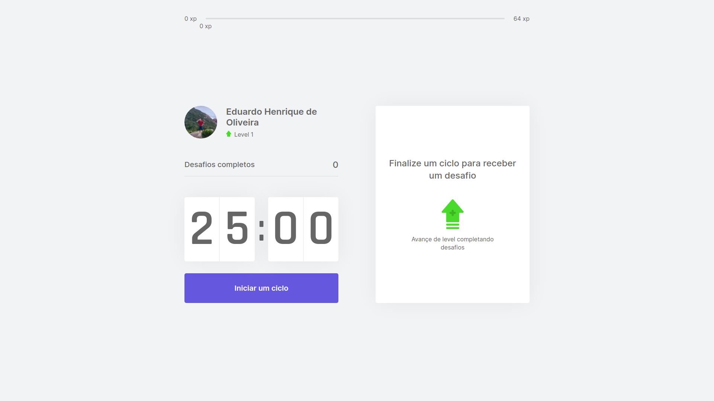
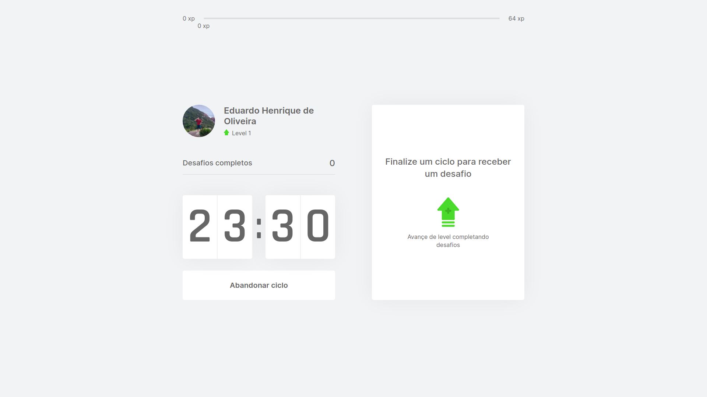
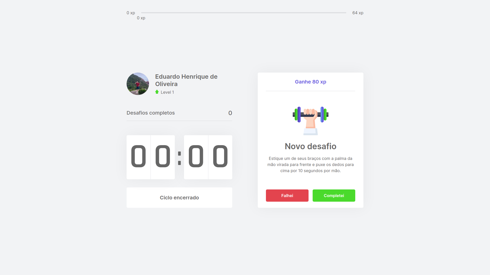
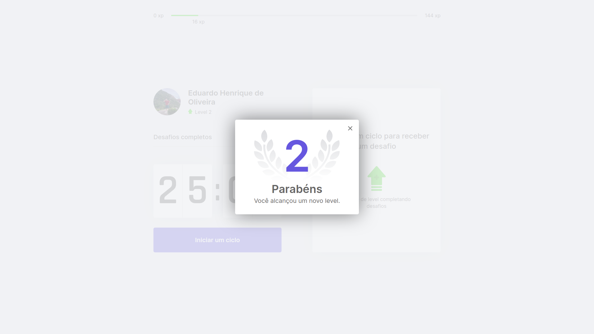

    

<strong>Move.it</strong> it's project that helps you to keep your productivity at 100%. We use here the Pomodoro technique, wich says that you need to take short breaks to maintain concentration and keep your mind away from fatigue. In the project you start a 25-minute work cycle, after the countdown ends, you are provided with an exercise that you need to perform. When you finish an exercise you recive XP, that makes you level up.

## Screenshots

### Start new cicle

### Cicle started

### Cicle finished

### Level up

## Technologies
### React JS

### NextJS

### Typescript

## My experience
This project was made in an online event focused on learning React JS. In the event I was able to learn about React Hooks, the context API and a little bit about Next.js.